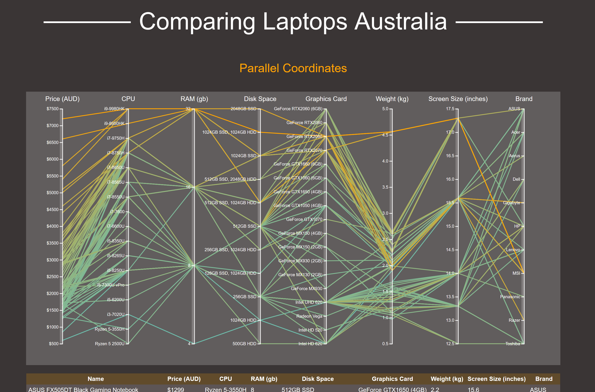

# Overview



This is my project for my Data Visualisation course at Swinburne University

The goal of this website is to help Australians find the perfect laptop.

# Opening the website

Click [here](https://jessica-woods.github.io/Compare-Laptops-Australia/) to visit the hosted version of this repo.

If you have a clone of this repo. Just open `index.html` in any browser. 

# Using the website

Click and drag any axis to filter the data on that axis. Click anywhere on the same axis to remove the filter.

# Running the scraper

This website is powered by a dataset scraped from https://www.scorptec.com.au/ (for educational purposes only!). The scraper is fairly lightweight
and only looks at search results, so hopefully the load isn't a problem.

To run the scraper make sure you change into the `laptopscraper/` directory and run:

```
scrapy crawl scorptec -o laptops.json -t jsonlines
```

Make sure to delete `laptops.json` before re-running as scrapy appends to the existing file.

The command will emit laptops.json containing json lines, one for each laptop. To turn the json lines into a valid json 
add `[` to the top of the file, `]` to the bottom of the file and append a `,` to each existing line.

To use the new data with the website, overwrite the `data/laptops.json` file in this repository.
